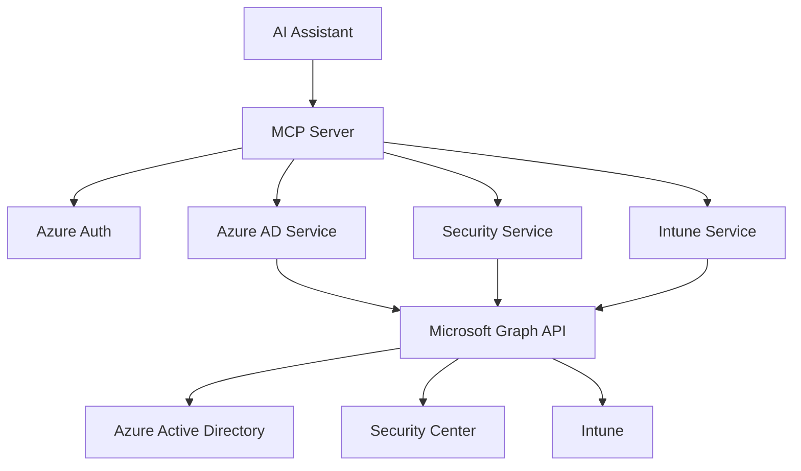

# Universal Microsoft Graph Intelligence 🚀
*Complete M365 ecosystem through conversational AI*

[](https://typescriptlang.org/)
[](https://azure.microsoft.com/)
[](https://modelcontextprotocol.io/)

## 🌟 The Vision

Transform your entire Microsoft 365 ecosystem into intelligent, conversational interfaces. This universal MCP server provides seamless access to Azure AD, Security Center, and Intune through natural language interactions.

## ✨ Universal Capabilities

### 👥 **Azure Active Directory**
- User management and search
- Group administration
- Role and permission analysis
- Sign-in activity monitoring

### 🛡️ **Security Center**
- Real-time threat detection
- Security alerts and incidents
- Risk assessment and scoring
- Identity protection insights

### 📱 **Intune Device Management**
- Comprehensive device inventory
- Compliance monitoring
- Application management
- Mobile device insights

## 🛠️ Available Tools

### Azure AD Tools
| Tool | Description | Parameters |
|------|-------------|------------|
| `get_users` | Retrieve all Azure AD users | None |
| `search_users` | Search users by name/email | `query: string` |
| `get_groups` | List all Azure AD groups | None |
| `get_user_roles` | Get user role memberships | `userId: string` |

### Security Tools
| Tool | Description | Parameters |
|------|-------------|------------|
| `get_security_alerts` | Retrieve security alerts | None |
| `get_risk_detections` | Get identity risk detections | None |
| `get_security_score` | Organization security score | None |

### Intune Tools
| Tool | Description | Parameters |
|------|-------------|------------|
| `get_intune_devices` | Retrieve managed devices | None |
| `search_intune_devices` | Search devices by name/email | `query: string` |
| `get_compliance_report` | Device compliance summary | None |
| `export_device_report` | Export device/compliance reports | `reportType?: string` |
| `get_device_rings` | List deployment rings | None |
| `lookup_device_ring` | Find device ring assignments | `deviceId: string` |

## 🚀 Quick Start

### Prerequisites
- Node.js 18+
- Azure AD application with Microsoft Graph permissions
- Access to Microsoft 365 services

### Installation
```bash
git clone <repository-url>
cd mcp-graphapi
npm install
npm run build
```

### Configuration
```bash
cp .env.example .env
# Configure your Azure AD credentials
```

## 🔧 Azure AD Setup

### Required API Permissions
```
Microsoft Graph → Application permissions:
├── User.Read.All (Azure AD users)
├── Group.Read.All (Azure AD groups)  
├── Directory.Read.All (Directory info)
├── DeviceManagementManagedDevices.Read.All (Intune)
├── DeviceManagementApps.Read.All (Intune apps)
├── SecurityEvents.Read.All (Security alerts)
├── IdentityRiskEvent.Read.All (Risk detections)
└── SecurityActions.Read.All (Security score)
```

### Setup Steps
1. **Register Application** in Azure Portal
2. **Add API Permissions** (see list above)
3. **Grant Admin Consent** for all permissions
4. **Create Client Secret**
5. **Update .env** with credentials

## 🏗️ Architecture



## 📝 Development

### Scripts
- `npm run build` - Compile TypeScript
- `npm run dev` - Development with hot reload
- `npm start` - Run compiled server
- `npm run clean` - Clean build output

### Testing
```bash
node test-server.js
```

## 🔒 Security Features

- **Zero-Trust Authentication** - Azure AD client credentials
- **Automatic Token Refresh** - Seamless session management
- **Minimal Permissions** - Least privilege access
- **Secure Configuration** - Environment-based secrets

## 🤝 Contributing

1. Fork the repository
2. Create feature branch
3. Implement changes
4. Add tests
5. Submit pull request

## 📄 License

MIT License - see LICENSE file for details

## 🆘 Troubleshooting

### Common Issues

**Authentication Error:**
```
invalid_client_credential: Client credential must not be empty
```
- Verify `.env` file exists with valid credentials
- Check Azure AD application permissions
- Ensure admin consent granted

**Permission Denied:**
```
Insufficient privileges to complete the operation
```
- Verify all required Graph API permissions added
- Confirm admin consent granted for permissions
- Check service principal has correct roles

**Module Resolution:**
```
Cannot find module
```
- Run `npm run build` to compile TypeScript
- Ensure all dependencies installed with `npm install`

## 📞 Support

For issues and questions:
- Create GitHub issue
- Review troubleshooting section
- Check Azure AD configuration