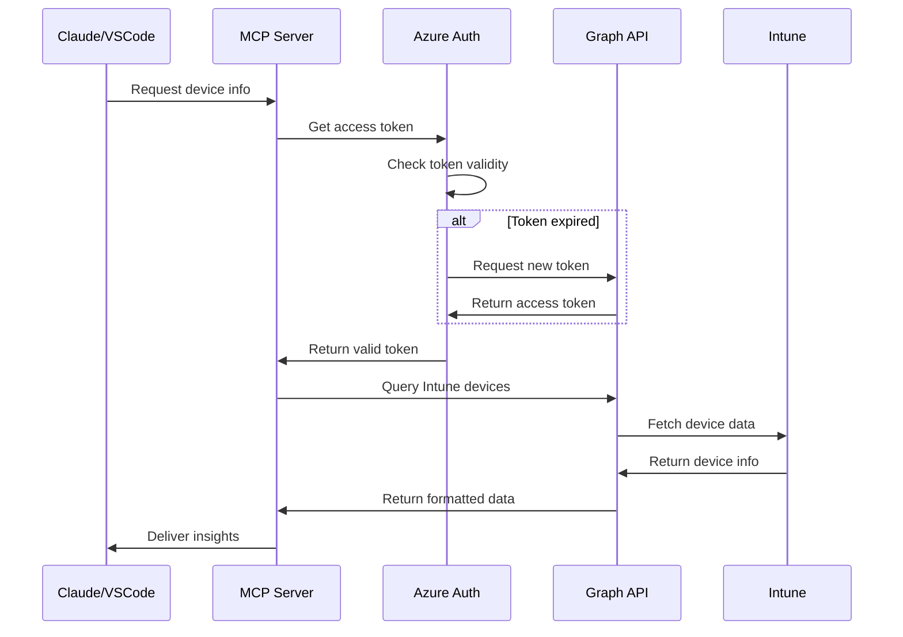

# Azure Graph API MCP Server 🚀
*Where Intune asset management becomes conversational intelligence*

[](https://typescriptlang.org/)
[](https://azure.microsoft.com/)
[](https://modelcontextprotocol.io/)

## 🌟 The Vision

Transform your Azure Intune infrastructure into an intelligent, conversational interface. This MCP server bridges the gap between Microsoft Graph API and AI assistants, making device management as intuitive as having a conversation with your infrastructure.

## ✨ Features

- 🔍 **Smart Device Discovery** - Find any device instantly by name, email, or ID
- 📊 **Comprehensive Asset Intelligence** - Full device details, compliance status, and sync history
- 📱 **Application Inventory** - Complete mobile app catalog with publisher information
- 🛡️ **Compliance Reporting** - Real-time compliance summaries and insights
- 🔐 **Enterprise Security** - Azure AD authentication with automatic token refresh
- 💬 **Conversational Interface** - Natural language queries through MCP protocol

## 🚀 Quick Start

### Prerequisites

- Node.js 18+ 
- Azure AD application with Microsoft Graph permissions
- Access to Microsoft Intune

### Installation

1. **Clone and install dependencies:**
   ```bash
   git clone <repository-url>
   cd mcp-graphapi
   npm install
   ```

2. **Configure Azure credentials:**
   ```bash
   cp .env.example .env
   # Edit .env with your Azure AD application details
   ```

3. **Build and run:**
   ```bash
   npm run build
   npm start
   ```

## 🔧 Configuration

### Azure AD Application Setup

1. **Register Application:**
   - Go to Azure Portal → Azure Active Directory → App registrations
   - Click "New registration"
   - Name: "MCP Graph API Server"
   - Supported account types: "Accounts in this organizational directory only"

2. **Configure API Permissions:**
   - Microsoft Graph → Application permissions:
     - `DeviceManagementManagedDevices.Read.All`
     - `DeviceManagementApps.Read.All`
     - `DeviceManagementConfiguration.Read.All`

3. **Create Client Secret:**
   - Go to "Certificates & secrets"
   - Click "New client secret"
   - Copy the secret value

4. **Update .env file:**
   ```env
   AZURE_CLIENT_ID=your-application-id
   AZURE_CLIENT_SECRET=your-client-secret
   AZURE_TENANT_ID=your-tenant-id
   ```

## 🛠️ Available Tools

| Tool | Description | Parameters |
|------|-------------|------------|
| `get_all_intune_devices` | Retrieve all managed devices | None |
| `search_intune_devices` | Search devices by name/email | `query: string` |
| `get_intune_device` | Get specific device details | `deviceId: string` |
| `get_intune_applications` | List all mobile applications | None |
| `get_compliance_report` | Device compliance summary | None |

## 🏗️ Architecture Flow



## 📝 Development

### Scripts

- `npm run build` - Compile TypeScript
- `npm run dev` - Development mode with hot reload
- `npm start` - Run compiled server
- `npm run clean` - Clean build directory

### Testing

```bash
# Test server functionality
node test-server.js
```

### Project Structure

```
src/
├── auth/
│   └── azure-auth.ts      # Azure AD authentication
├── services/
│   └── intune.ts          # Intune API service
├── types/
│   └── index.ts           # Type definitions
└── server.ts              # MCP server implementation
```

## 🔒 Security

- Uses Azure AD client credentials flow
- Automatic token refresh
- No credentials stored in code
- Environment-based configuration

## 🤝 Contributing

1. Fork the repository
2. Create a feature branch
3. Make your changes
4. Add tests if applicable
5. Submit a pull request

## 📄 License

MIT License - see LICENSE file for details

## 🆘 Troubleshooting

### Common Issues

**Authentication Error:**
```
invalid_client_credential: Client credential must not be empty
```
- Ensure `.env` file exists with valid Azure credentials
- Verify Azure AD application has required permissions
- Check that admin consent has been granted

**Module Not Found:**
```
Cannot find module './services/intune'
```
- Run `npm run build` to compile TypeScript
- Ensure all dependencies are installed with `npm install`

**Permission Denied:**
```
Insufficient privileges to complete the operation
```
- Verify Azure AD application has correct Graph API permissions
- Ensure admin consent has been granted for the permissions

## 📞 Support

For issues and questions:
- Create an issue in the repository
- Check the troubleshooting section
- Review Azure AD application configuration